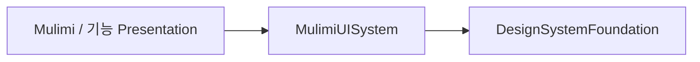

# 디자인 시스템

## 모듈과 의존 방향



화살표는 import와 타깃 의존 방향이다. 현재 직접 소비자는 HydrationPresentation과 ChallengePresentation이며, Mulimi 앱은 이 기능 화면을 조합한다.

| 모듈 | 소유하는 코드 | 소유하지 않는 코드 |
| --- | --- | --- |
| DesignSystemFoundation | 기본 색상·간격·폰트·컨트롤 크기·모션 값, CircleHighlight | Mulimi 브랜드 리소스, 기능 모델, 현지화, 세션·저장·내비게이션 |
| MulimiUISystem | MulimiTheme, 의미 색상, LiquidGlassSegmentedControl, 물방울 반사 효과 | 기능별 문구 선택, 비즈니스 판단, ViewModel |
| 기능 Presentation | 화면 조합, 표시 문구·심볼·선택 값, Binding과 동작 연결 | Foundation 직접 사용 |

Foundation은 SwiftUI 기반 UI 모듈이다. 기능 Domain의 순수성 규칙과 혼동하지 않는다. 두 모듈은 Feature/Core/App/Localization에 의존하지 않으며, Foundation의 유일한 제품 소비자는 MulimiUISystem이다. `internal import DesignSystemFoundation`으로 UI 공개 API에 Foundation 타입을 노출하지 않는다.

## 공개 API

### DesignSystemFoundation — UISystem에서 사용

- `DesignTokens.Palette`: highlight/shadow의 흰색·검정 기본값
- `DesignTokens.Spacing`: compact/tight 간격
- `DesignTokens.Typography.emphasizedCaption`: Dynamic Type을 따르는 caption/semibold
- `DesignTokens.Control`: 기본·접근성 최소 높이와 테두리 두께
- `DesignTokens.Motion.quick`: 0.25초 ease-out 애니메이션
- `CircleHighlight(diameter:color:)`: 접근성 탐색에서 제외되는 장식 원

현재 컴포넌트에 사용되는 값만 제공한다. 모서리는 SwiftUI `Capsule`을 사용하므로 별도의 임의 radius 토큰은 없다.

### MulimiUISystem — 화면에서 사용

- `MulimiTheme.accent`, `.background`: framework 리소스 색상. 기존 `Color.accent`, `.background`도 같은 테마로 연결한다.
- `LiquidGlassSegment<Value>`: `value`, 표시 `title`, 선택적 `systemImage`를 받는다.
- `LiquidGlassSegmentedControl(selection:segments:)`: 호스트가 Binding과 표시 항목을 전달한다. 선택 색상은 기존처럼 `Color.accentColor`를 따라 호스트 tint를 보존한다.
- `WaterDropGlareEffectModifier`, `View.waterDropGlareEffect()`: 기존 물방울 반사 효과 API. 원의 배치·크기·투명도는 Mulimi 표현에 속한다.

```swift
import MulimiUISystem
import SwiftUI

// title과 systemImage의 선택은 기능 Presentation이 담당한다.
LiquidGlassSegmentedControl(
    selection: $selection,
    segments: [.init(value: 0, title: title, systemImage: "drop.fill")]
)
```

## 리소스와 플랫폼

- `AccentColor`와 `BackgroundColor`는 MulimiUISystem의 `Resources/Assets.xcassets`가 소유한다. 테마는 `Bundle(for:)`로 framework를 지정하며 `Bundle.main`에 기대지 않는다.
- AccentColor는 systemTeal, BackgroundColor는 라이트 `#EBEAE6`·다크 검정인 기존 값을 유지한다.
- `bubble.json`은 Swift 사용처와 리소스 로더가 없어 제거했다.
- 두 Tuist 타깃의 지원 플랫폼은 **iOS 26.0+**다. Foundation의 SwiftUI 토큰·원시 요소에는 UIKit 사용이 없지만 다른 플랫폼 지원을 선언한 것은 아니다.
- UISystem의 세그먼트 배경은 `UIColor.systemBackground/secondarySystemBackground`를 사용하므로 iOS 구현이다. Watch/Widget 포팅은 별도 작업이다.

## 접근성과 검증

- Reduce Motion: 선택 애니메이션을 생략한다.
- Reduce Transparency: material 대신 불투명 시스템 배경을 사용한다.
- 접근성 글씨 크기: 최소 높이를 늘리고 라벨을 두 줄까지 허용한다.
- 선택 항목은 `.isSelected` 접근성 trait와 호출자가 전달한 라벨을 유지한다.
- `MulimiUISystemTests`는 실제 framework 색상 로드, 라이트·다크 RGBA 값, 모션·글씨 크기 정책과 컴포넌트 렌더링을 확인한다. 실제 탭 동작과 접근성 트리는 시뮬레이터에서도 확인한다.
- `make arch-check`는 `scripts/check-ui-boundaries.py`로 Swift import와 Tuist의 리터럴 `.target/.project/.external` 선언을 검사한다. 동적으로 계산한 의존 목록을 해석하는 Swift 파서는 아니므로 UI 모듈 의존성은 manifest에 명시적으로 선언한다.
- `python3 scripts/test-ui-boundaries.py`는 앱/Presentation의 Foundation 직접 사용, 두 UI 모듈의 역방향 의존, Domain UI 의존과 레거시 DesignSystem 사용을 회귀 검사한다. CI lint job에서도 실행한다.

전체 타깃 목록과 그림은 [프로젝트 구조·의존성](project-architecture-and-dependencies.md)에 있다.
